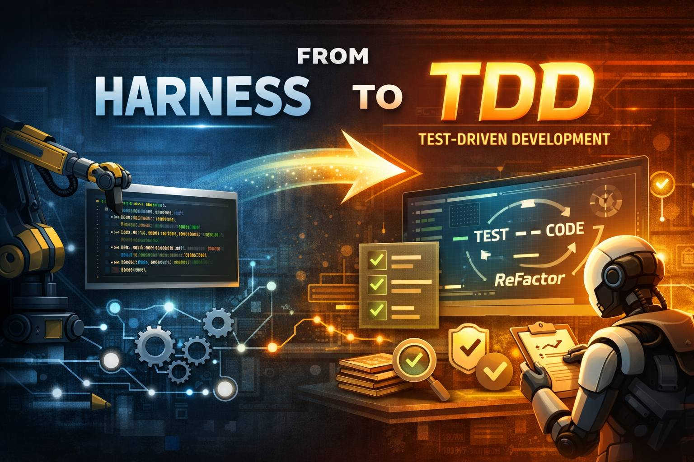

# AI 에이전트를 위한 TDD 프롬프트

[English](README.md) | [한국어](README.ko.md)

> AI 재작업을 눈에 띄게 줄이는 프롬프트 — 테스트 주도 개발(TDD)



---

## 이것은 무엇인가?

AI 코딩 에이전트(Claude, GPT, Gemini, Codex 등)와 함께 **테스트 주도 개발(TDD)**을 적용하기 위한 실전 검증 프롬프트 모음입니다.

**핵심 아이디어:** TDD는 장기 기억을 소스코드에 직접 박아넣습니다 — AI 에이전트가 컨텍스트를 잃어도, 테스트가 코드가 무엇을 해야 하는지 기억합니다.

> **기획의 장기기억은 md파일에.**
> **개발의 장기기억은 TDD에.**

---

## 왜 AI에게 TDD인가?

인간이 TDD를 힘들어 한 이유는 MVP가 급하니까 테스트 코드 개발을 생산성으로 여기지 않고, 실행 코드만큼 개발 시간이 걸리기 때문입니다. AI도 시간은 마찬가지지만, 인간과 달리 **실제로 해낼 수 있습니다.**

TDD의 장점은 MVP 때 빛나는 것이 아닙니다. 빛나는 순간은:

- **실제 서비스 운영 시** — 사용자가 버그를 만나기 전에 잡음
- **에이전트 인수인계 시** — 다른 AI 에이전트로 전환할 때 테스트가 명세서 역할을 함
- **컨텍스트 윈도우가 리셋될 때** — 세션 기억은 사라져도 테스트는 남음

---

## TDD vs. 하네스 패턴

| | 하네스 | TDD |
|---|---|---|
| 목적 | 빠른 MVP 구축 | 장기 코드 품질 보장 |
| QA | 포함됨 | 테스트 통과 후 별도 실행 |
| 적용 시기 | 먼저 (MVP 단계) | MVP 안정화 후 |
| 범위 | 새 기능 | 전체 코드베이스 리팩토링 |

같이 쓸 수 있지만, **별도로 적용**하는 것이 현명합니다 — 하네스로 먼저 구축하고, TDD로 다지기.

---

## 프롬프트

### 1. TDD 시작

```
"우리 지금 테스트 주도 개발(TDD) 하고 있나?"
```

> **주의:** TDD는 기본값이 터미널 CLI 환경입니다. 화면UI(프론트엔드)에 TDD를 적용하면 디자인 창의성이 낮아질 수 있으니 선택할 것.
>
> 예시: *(같은 프롬프트에 이어서)* "하지만 프론트엔드는 TDD에서 빼줘."

### 2. 전체 범위 TDD

```
"우리 프로젝트 전체에 테스트 주도 개발(TDD)로 리팩토링 하자."
```

> 메인 에이전트는 토큰 소모를 줄이려 자기 할 일을 축소하려 합니다. "전체 범위"라고 명시하지 않으면 새로운 작업에만 TDD를 적용합니다.
>
> **주의:** 오픈소스 기여 등 팀 작업에서 건드리면 안 될 폴더는 미리 규칙으로 말해두세요.
>
> 예시: *(같은 프롬프트에 이어서)* "하지만 OOO은 절대 건드리지 말고 OOO으로 한정해. 이 규칙은 이 프로젝트에만 한정된 거니까 전역 워크스페이스 메모리에 기록하지 말고 프로젝트 내부 메모리에만 기억해둬."

### 3. 무중단 멀티에이전트

```
"Phase1~10을 무중단으로 진행해.
서브에이전트가 타임아웃되면 3회까지 재시도해보고,
안 되면 메인에이전트가 해당 세부 스프린트만 처리하고 다음 스프린트로 넘어가."
```

> 'Phase1~10'은 예시입니다. 메인 에이전트가 정의한 내용에 따라 바꿔 쓰세요.

### 4. 진행 상황 확인 (주의!)

```
"잘 진행되고 있나?"
```

> ⚠️ **"진행 상황 체크"라고 물어보면 안 됩니다.** '체크'라는 키워드에 메인 에이전트가 **새로운 할 일**이라고 반응하여, 본래 하던 작업을 아예 손 놓습니다.

### 5. 테스트 직접 실행

```
"네가 직접 테스트 실행해서 확인해줘."
```

> TDD가 완성되어도 메인 에이전트는 테스트 세트에 손도 안 대어본 채 사용자에게 돌려주는 경우가 많습니다.

### 6. QA 및 코드 리뷰

```
"QA, 코드리뷰 해줘."
```

> 테스트 세트가 **모두 안전하게 돌아간 후**에만 이 말을 하세요. TDD 과정에서 기획 스펙을 망쳐놓거나 몰랐던 오류를 발견했을 수 있습니다.
>
> ⚠️ **경고:** 테스트가 아직 안정적이지 않으면 이 말을 하지 마세요. 사용자가 직접 테스트부터 고쳐야 합니다. 그렇지 않으면 원래 안 되는 걸 반복 수정하느라 소스코드 전체를 망칠 수 있습니다.

---

## AI 시대의 TDD

TDD는 프로그램 실행할 때(런타임) 오류 나서 사용자가 직접 손대어야 할 일을, 소스코드 수준(빌드타임)에서 AI가 미리 잡는 개발방법론입니다. TDD의 정확한 정의는 다르지만, AI 시대에는 이렇게 해석해도 됩니다.

한 세션 안에서만 기억이 남고 컨텍스트 윈도우가 바뀌면 기억조차 사라져서 md파일로 장기기억을 만들어왔다면, TDD는 장기기억을 소스코드 레벨에 박아넣는 방법이 됩니다.

---

## 요약

> **기획의 장기기억은 md파일에.**
> **개발의 장기기억은 TDD에.**

---

[📄 GitHub에서 소스 보기](https://github.com/haseo-ai/tdd-prompts-ai)

---

*Made by [haseo-ai](https://github.com/haseo-ai) ♥ with oclo*
